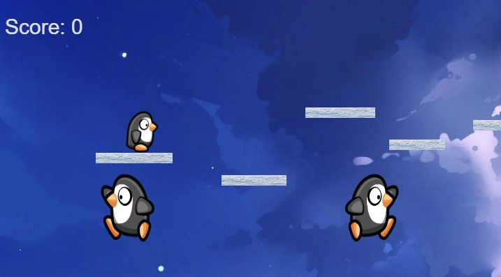

# Penguin Runner



Penguin Platform is a simple, yet addictive 2D platform game. You control a cute penguin to navigate through different levels, overcome obstacles, and reach the final destination.
The game engine build in [Typescript](https://www.typescriptlang.org/) using Canvas packed into a [Next.js](https://nextjs.org/) application.
# Gameplay
As a player, you control a little penguin to traverse through challenging platform levels filled with obstacles. The objective is simple - reach the endpoint of each level safely.

# Controls
The controls of the game are straightforward:

- **Left Arrow Key**: Move left
- **Right Arrow Key**: Move right
- **Up Arrow Key**: Jump
#Technologies Used
- Typescript
- Next.js
- Canvas
- HTML5
- CSS3
# Setup and Installation
You can clone the project to your local machine or just download the zip from this repository.

* To clone the project:
```bash
git clone https://github.com/<yourusername>/penguin-platform.git
```
* Go to the project directory:
```bash
cd penguin-platform
```
* Open the index.html file in your preferred web browser.


# Future Enhancements
- Increase the number of levels
- Add power-ups and collectables
- Add more complex obstacles and enemies
- Contributing
- Pull requests are welcome. For major changes, please open an issue first to discuss what you would like to change. Please make sure to update tests as appropriate.

# License
[**MIT**](https://choosealicense.com/licenses/mit/)


